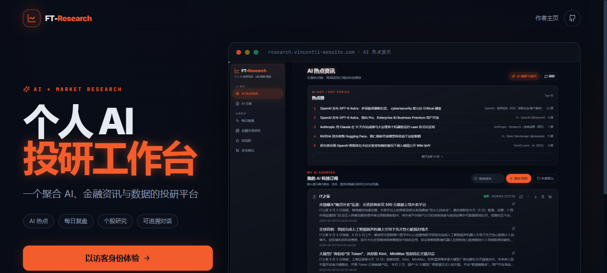
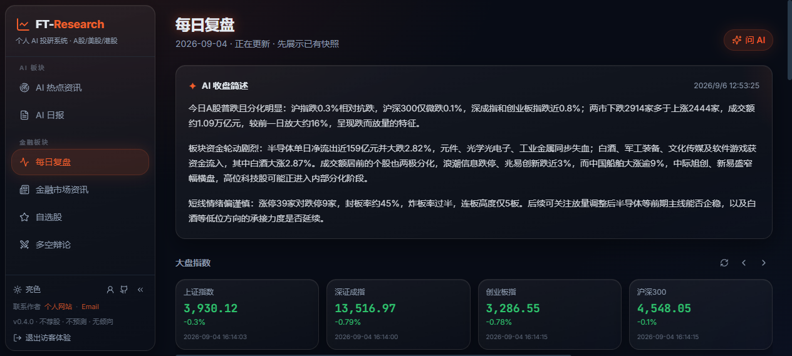
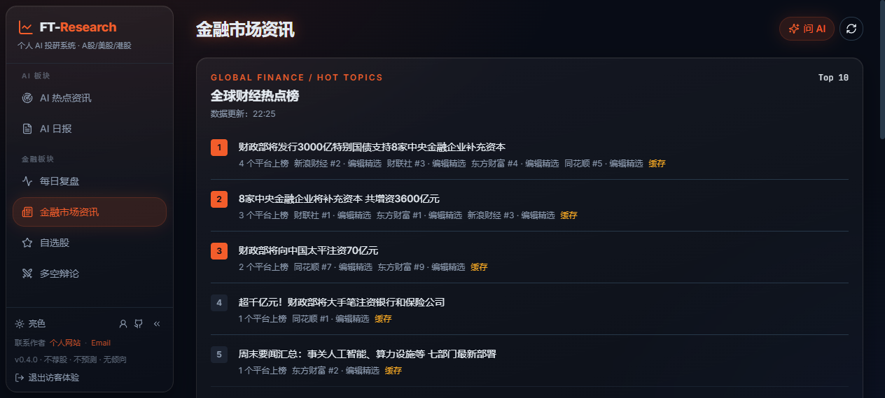
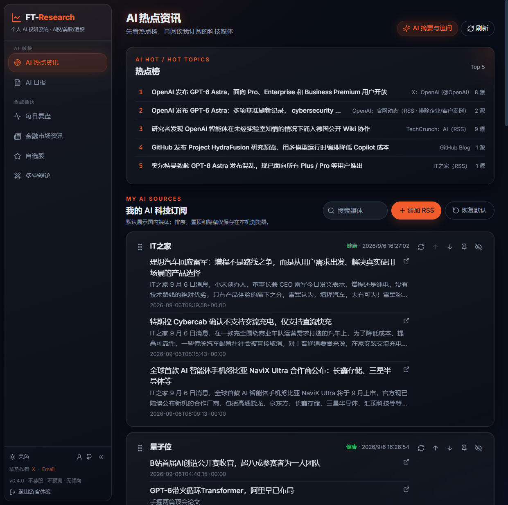
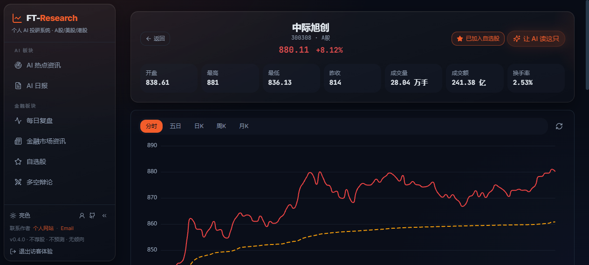

<p align="center"><b>简体中文</b> | <a href="README_en.md">English</a></p>

<h1 align="center">FT-Research · 个人 AI 金融研究工作台</h1>

<p align="center">
  <a href="https://research.vincentli-website.com">🌐 在线演示</a> ·
  <a href="#产品预览">产品预览</a> ·
  <a href="#功能">功能</a> ·
  <a href="#架构">架构</a> ·
  <a href="#快速开始">快速开始</a> ·
  <a href="#部署">部署</a> ·
  <a href="#管理员--访客体系">管理员 / 访客</a>
</p>

[](LICENSE)
[](https://www.python.org/)
[](https://react.dev/)
[](https://fastapi.tiangolo.com/)

> **把分散的投研信息收拢为可继续验证的研究线索。**
>
> FT-Research 整合 AI 热点资讯、证据优先的财经新闻、每日市场复盘、个股研究与 AI 会话，由**服务端托管的 GLM 模型**驱动，支持 Owner / Guest 双角色隔离与云端部署。已有公开演示站点，克隆即可自部署。

## 在线演示

**<https://research.vincentli-website.com>** — 打开落地页，点击「以访客身份体验」即可进入（访客身份下模型调用受限流，数据与管理员相互隔离）。

## 产品预览

**落地页** — 公开入口，访客一键体验



<table>
<tr>
<td width="50%">

**每日市场复盘** — 大盘指数、市场结构与 AI 收盘综述，数据新鲜度透明可查



</td>
<td width="50%">

**金融市场资讯** — 全球财经热点榜，要点可回溯来源



</td>
</tr>
<tr>
<td width="50%">

**AI 热点资讯** — 热点榜 + 可排序 / 置顶 / 隐藏的 RSS 订阅流



</td>
<td width="50%">

**个股研究** — 行情 + 财务 + 「让 AI 读这只」上下文入口



</td>
</tr>
</table>

---

## 功能

站点导航分两级：**AI 板块**（资讯与报告）+ **金融板块**（行情与复盘）。

### AI 板块

| 页面 | 能力 |
|---|---|
| 🤖&nbsp;**AI 热点资讯**（`/ai/news`） | 热点榜 Top 5 · 可排序 / 置顶 / 隐藏的 RSS 订阅流 · 按发布时间排列 · 每个信源标注刷新状态（成功 / 失败 / 缓存回退） |
| 📰&nbsp;**报告中心**（`/ai/daily`） | **每日 08:00 定时固化**的 AI 日报 / 周报 / 月报，网页解析入库，历史报告可回看 |
| 💬&nbsp;**AI 会话工作台**（`/ai/conversations`） | 服务端托管 GLM（**Key 不出后端**）· NDJSON 流式回答、**中断可恢复** · 会话历史 SQLite 持久化、支持再次访问 · 可从全站任意页面**携带上下文**进入 |

### 金融板块

| 页面 | 能力 |
|---|---|
| 📊&nbsp;**每日市场复盘**（`/finance/review`） | 大盘指数 · 市场结构 · **盘后自动生成 AI 复盘简报**（定时调度、幂等执行、context-only 不做推荐）· 完整历史数据回看 |
| 📡&nbsp;**金融市场资讯**（`/finance/news`） | **证据优先**的财经新闻聚合：要点标注来源、可回溯原文 · 全球要闻 · Following 关注流 · 按源刷新、状态透明 |
| 🔍&nbsp;**个股研究**（`/finance/stocks/:code`） | 搜索归一化 + 防抖 · A 股 / 美股 / 港股行情与关键财务 · 全站统一入口 · **批量导入自选** · 「让 AI 读这只」一键携上下文进会话 |
| ⚔️&nbsp;**多空辩论**（`/finance/debate`） | 多 agent：客观事实底稿 → 多方 / 空方研究员立论 → 中立主持归纳共识与分歧，**刻意不产出买卖结论** |
| ⭐&nbsp;**自选股**（`/finance/watchlist`） | 批量粘贴代码即加 · 一屏表格总览 · 一键交给 AI |

> **边界**：只做客观数据整理与公开信息聚合，**不荐股、不预测涨跌、不给买卖时机**；AI 只解释与组织上下文，分析方向由使用者自己判断。

## 架构

```
FT-Research/
├── backend/                FastAPI :8900
│   ├── app.py                应用入口
│   ├── financial_news.py     证据优先财经新闻聚合链
│   ├── financial_hotlist.py  全球财经热点榜
│   ├── financial_editorial.py 要点编辑与来源标注
│   ├── news_sources.json     RSS 订阅源配置（按源刷新）
│   ├── aihot_api.py          AI HOT 热点只读代理（ETag 缓存 + 失败回退）
│   ├── aihot_reports.py      日报 / 周报 / 月报报告中心（每日 08:00 定时固化）
│   ├── market_review.py      每日复盘数据
│   ├── market_review_brief.py 盘后 AI 复盘简报（幂等调度、context-only）
│   ├── chat.py               AI 会话（服务端托管 GLM、NDJSON 流式）
│   ├── conversation_routes.py 会话持久化与恢复
│   ├── auth.py / auth_routes.py  Owner / Guest 鉴权（密码哈希、访客令牌）
│   ├── ai_limits.py          模型调用限流（身份 / IP / 输入长度）
│   ├── astock.py / gstock.py A 股 / 美股港股数据
│   ├── market.py             指数与市场情绪
│   └── debate.py             多空辩论编排
├── frontend/               Vite + React 19 + TypeScript :5899
├── deploy/tencent-lighthouse/  生产部署（compose / Caddy / 预检 / 备份脚本）
└── docs/                   部署与设计文档
```

**两条自动化链路**：

```
资讯链路   RSS / AI HOT → 解析去重 → 证据标注（要点可回溯）→ 热点榜 / 订阅流 / 要闻
报告链路   每日 08:00 定时固化日报/周报/月报 · 盘后自动生成复盘简报（幂等，离线不重跑）
会话链路   任意页面携上下文 → 服务端 GLM → NDJSON 流式（可中断恢复）→ SQLite 会话历史
```

## 快速开始

```bash
# 后端（:8900）
cd backend && python3 -m venv .venv && .venv/bin/pip install -r requirements.txt
.venv/bin/python -m uvicorn app:app --host 127.0.0.1 --port 8900

# 前端（:5899）
cd frontend && npm install && npm run dev
# 浏览器打开 http://localhost:5899
```

AI 会话需要配置 GLM API Key（服务端环境变量，不进前端）。资讯、复盘、行情等数据功能开箱即用。

## 部署

提供腾讯云 Lighthouse 的完整生产方案：Docker / compose 编排、Caddy 反代与自动 HTTPS、生产预检（preflight）与备份脚本。

- 完整步骤：[`deploy/tencent-lighthouse/README.md`](deploy/tencent-lighthouse/README.md)
- Owner / Guest 上线配置：[`docs/OWNER_GUEST_DEPLOYMENT.md`](docs/OWNER_GUEST_DEPLOYMENT.md)

## 管理员 / 访客体系

- **管理员（Owner）**：密码经 `python scripts/owner_password.py` 生成哈希后配置 `FT_OWNER_PASSWORD_HASH`，历史会话保存在服务端 SQLite。
- **访客（Guest）**：令牌仅存当前页面内存，刷新 / 退出即失效；服务端按身份、IP 与输入长度多维限制模型调用；数据与管理员相互隔离。
- HTTPS 下配置 `FT_AUTH_SECURE_COOKIE=true`；密钥与密码一律不写入仓库。

## 测试

```bash
cd backend && .venv/bin/pip install -r requirements-dev.txt
.venv/bin/pytest -m "not live"   # 离线单测 + API 校验
cd frontend && npm test          # 前端测试
```

前后端累计约 90 个测试。

## License

MIT

## 致谢

本项目在 [Vibe-Research](https://github.com/simonlin1212/Vibe-Research)（作者 Simon Lin，MIT）的基础上二次开发：行情 / 辩论等基础看板沿用上游能力，AI 资讯、报告中心、每日复盘简报、AI 会话工作台、权限体系与云端部署为独立扩展。

## 免责声明

本项目仅供学习与研究，不构成任何投资建议。股市有风险，请独立决策、自行核实，风险自担。
